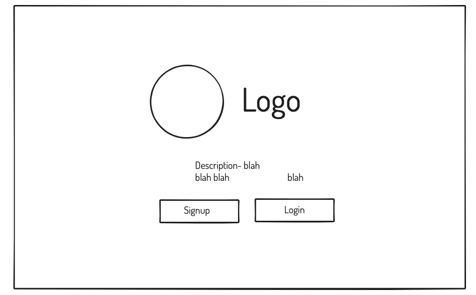
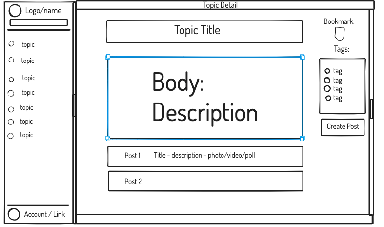
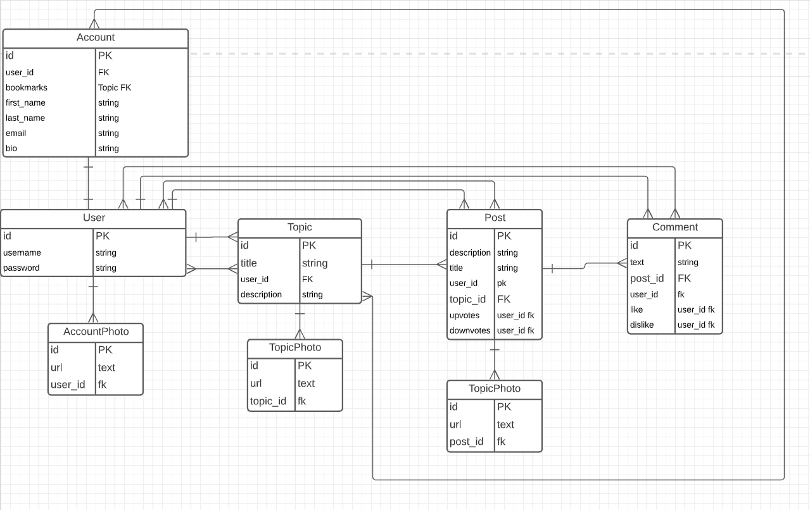
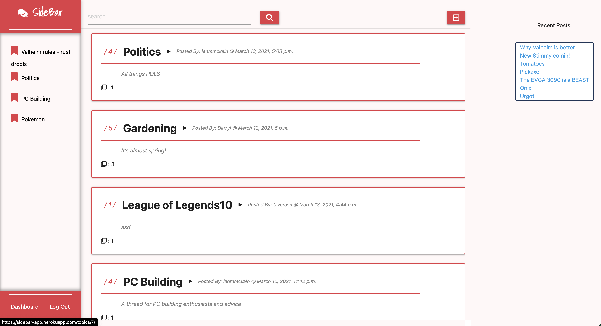

# SideBar
---

SideBar is a forum like web-app that allows users to create topics, posts within those topics, and comments on the posts. 
The idea of the sidebar is that all of your bookmarked topics are right where you need them; in the sidebar!
With full CRUD, photo upload, likes, dislikes, up and down voting we have a lot to offer a vast community of users.

## Please checkus out @ [SideBar](https://sidebar-app.herokuapp.com/](https://sidebar-app-bd7eaebfac41.herokuapp.com) 🌐

Features:
- User login and account creation
- Create topics, posts, and comments
- Full CRUD
- AWS S3 Photo Upload
- Like, dislike, upvote, downvote, and bookmarks

---

Future Enhancements:
- Dark Mode
- Custom Styling for Topics You've Created
- Meme Generation
- Ability to upload Videos and Polls
- Search Bar
- Topics Index will show Topics that share tags that your bookmarked Topics have

---

Unolved Problems:
- CRUD for Photos
- Deleting the User when Account gets deleted

## Technologies Used 💻

-  Django
-  Python
-  PostgreSQL
-  HTML 5 & CSS
-  JavaScript
-  Heroku
- 🔐 Auth

---

## Wireframes 🔲

### Landing Page

---

### Index Page

---

### Topic Detail Page

---

### Create Topic Page

---

### Post Index Page

---

### Create Post Page

---

## ERD 

---

## Screenshots 📸

### Landing Page

---

### Index Page

---

### Topic Detail Page

---

### Post Index Page

---

### Create Post Page

---

### Post Detail Page

---

## Trello Planning @ [SideBar Trello](https://trello.com/b/417AQ8bB/project-4-django)
